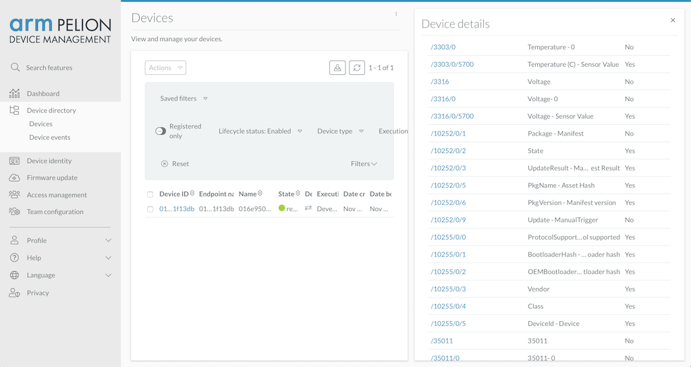

# Pulling Device Resource Values from Pelion Device Management to Treasure Data

**[Pelion Device Management](https://www.pelion.com/iot-device-management/)** (PDM) is an IoT device management platform that accelerates your IoT project by providing a way to connect, secure, monitor and update massively deployed devices at scale and ease. 

PDM itself, however, does not store device data (i.e., resource values of your devices), and hence **[Pelion Data Management](https://www.arm.com/products/iot/pelion-iot-platform/data-management)** (Treasure Data; TD) becomes a place where your device data is securely stored in the cloud for analyzing historical data, integrating with the other Physical and Digital data sources, gaining deeper insights and making business outcomes.

## Overview

This Box demonstrates a simple way of pulling resource values from PDM to TD via [`ConnectAPI`](https://www.pelion.com/docs/device-management/current/service-api-references/device-management-connect.html) called by [PDM Python Client](https://github.com/ARMmbed/mbed-cloud-sdk-python) running on the [Treasure Workflow Custom Scripting](https://support.treasuredata.com/hc/en-us/articles/360026713713-Introduction-to-Custom-Scripts) capability.

We assume your device has already been registered to PDM. For instance, if you are right after finishing [PDM IoT Connection Tutorial](https://os.mbed.com/guides/connect-device-to-pelion/), device and resource information can be listed as follows:



Eventually, the resource values will be regularly captured by a scheduled TD Workflow and stored into a TD table as:


Note that this example is not the only option to connect PDM with TD since PDM exposes [multiple APIs](https://www.pelion.com/docs/device-management/current/service-api-references/service-api-documentation.html) for accessing devices and integrating with third parties.

## Usage

First, refer [`config.sample.yml`](./config.sample.yml) and create your own `config.yml` file with a target device ID and TD database/table name.

Next, push the workflow to TD:

```sh
td wf push pelion_device
```

Here, get your API key and endpoint from [PDM](https://preview.pelion.com/docs/device-management/current/integrate-web-app/api-keys.html) and [TD](https://support.treasuredata.com/hc/en-us/articles/360000763288-Get-API-Keys), and set them to the workflow secrets:

```sh
td wf secrets \
	--project pelion_device \
	--set td.apikey=${TD_API_KEY} \
	--set td.apiserver=${TD_API_SERVER} \
	--set pdm.apikey=${MBED_CLOUD_SDK_API_KEY} \
	--set pdm.host=${MBED_CLOUD_SDK_HOST} 
```

By default, [`pelion_device.dig`](./pelion_device.dig) is executed on an hourly basis, and the latest resource values will be continuously captured and inserted into the target table. For more information about pricing and enablement of the underlying advanced functionality, Treasure Workflow Python Custom Scripting, contact your TD Customer Success representative.

To manually kick the workflow and make sure its behavior, run:

```sh
td wf start pelion_device pelion_device --session now
```

Finally, check if device data is available on TD from the TD SQL interface:

```sql
select * from {database_name}.{table_name}
```
