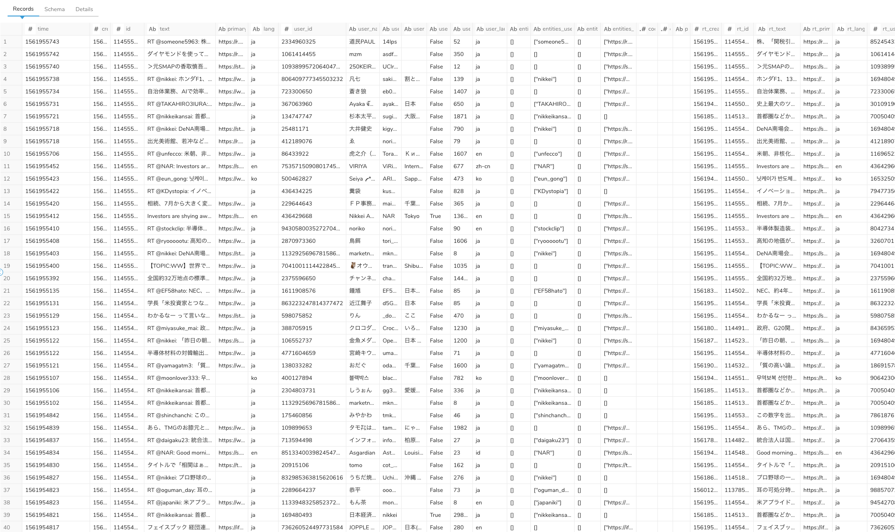
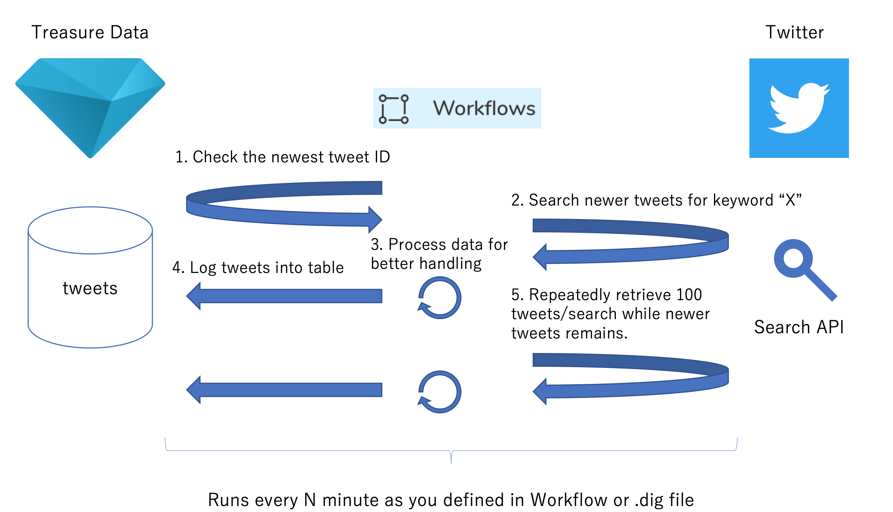

# Twitter Search Archiver
Want to calculate the number of shares for specific URL? Wish to find influencers around your brand? You can accumulate tweets containing a keyword you specified by running this script on Treasure Data's Workflow or DigDag.
The script calls Twitter Search API with standard license (no need to have Premium or Enterprise license), and then data is stored into the specified table. An iterator is managed across multiple run time so that data will be updated incrementally.

# Installation

## Prerequisite
- Need Treasure Data API key which is Master Key permission.
- Twitter API credentials required. You can issue it on [Twitter Developer Portal](https://developer.twitter.com/) but you need to wait for screening and the process may takes few days.

## Create a destination table and define the schema
```sh
td db:create example_db
td table:create example_db tweets
td schema:add example_db tweets created_at:int id:int text:string primary_url:string lang:string user_id:int user_name:string user_screen_name:string user_location:string user_verified:string user_followers_count:string user_lang:string entities_hashtags:string entities_user_mentions:string entities_symbols:string entities_urls:string coordinates_longitude:float coordinates_latitude:float place:string rt_created_at:int rt_id:int rt_text:string rt_primary_url:string rt_lang:string rt_user_id:int rt_user_name:string rt_user_screen_name:string rt_user_location:string rt_user_verified:string rt_user_followers_count:string rt_user_lang:string rt_entities_hashtags:string rt_entities_user_mentions:string rt_entities_symbols:string rt_entities_urls:string qs_created_at:int qs_id:int qs_text:string qs_primary_url:string qs_lang:string qs_user_id:int qs_user_name:string qs_user_screen_name:string qs_user_location:string qs_user_verified:string qs_user_followers_count:string qs_user_lang:string qs_entities_hashtags:string qs_entities_user_mentions:string qs_entities_symbols:string qs_entities_urls:string
```

## Push the code and set variables
```sh
td wf push twitter_search_archiver
td wf secrets --project twitter_search_archiver --set td.apikey td.endpoint td.database td.table
td wf secrets --project twitter_search_archiver --set tw.consumer_key tw.consumer_secret tw.access_token tw.access_token_secret
td wf secrets --project twitter_search_archiver --set tw.search_keyword
```

|Variable|Description|Example|
|:---|:---|:---|
|`td.apikey`|An API key to be used in the script. Access Type must be `Master Key`.|`1234/abcdefghijklmnopqrstuvwxyz1234567890`|
|`td.endpoint`|TD's API endpoint starting with `https://`.|`https://api.treasuredata.com`|
|`td.database`|A database name which contains the destination table.|`example_db`|
|`td.table`|A table name you want to store the result into.|`tweets`|
|`tw.consumer_key`|Twitter's API key from Consumer API keys section.|`012345ABCDEF`|
|`tw.consumer_secret`|Twitter's API secret key from Consumer API keys section.|`xyz123ABC987xyz123ABC987xyz123ABC987`|
|`tw.access_token`|Twitter's Access token from Access token & access token secret section.|`12345678-1234abcd9876ABCD`|
|`tw.access_token_secret`|Twitter's Access token from Access token secret & access token secret section.|`ABCDEFG1234567890XYZ1234567890`|
|`tw.search_keyword`|A search term you want to archive tweets.|`treasuredata.com`|

# Data you'll get

- The data structure is basically the same as Twitter's API response
- Some objects are converted into JSON string and stored in the dedicated column so you can query it by using JSON function.
- There are columns starting with `primary*` which have a URL as a value. Thise columns have the first URL in shared URLs or a URL matched with search term. The purpose of these columns is to help analysts to aggregate data by shared URL for evaluating the content.



# Mechanism

1. The script retrieves the newest tweet ID from the table first. (if there is no data, the script will accumulate tweets from oldest one which you can access with your Twitter API license)
2. The script calls Twitter's Search API by specifying search term you defined, and will receive up to 100 tweets per a search.
3. The, tweets are processed in bulk inserted into the table.
4. If there are more than 100 tweets, the script will continue to search the tweets and save the result.



Note that the script throttles the search frequency once in 2 sec due to Twitter's rate limit.
